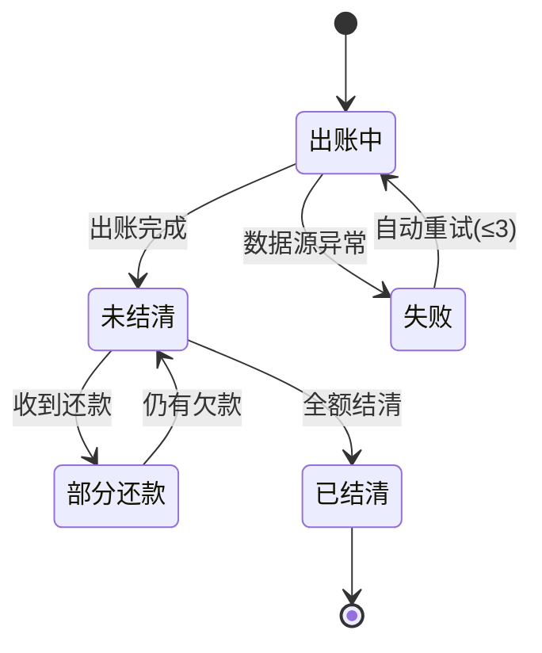

# PRD 标准撰写技能（pm-prd-standard）

> 用途：把"零散需求/原型图/口述"快速收敛为一份结构完整、逻辑闭环、可直接进评审的 PRD，并沉淀为可复用模板。

## 〇、定位说明（与 pmaster__skillhub 的差异）
- 本 skill：聚焦**标准模板 + 量化验收 + 修订留痕**的"落地撰写规范"，产出即可进评审的文档。
- `pmaster__skillhub`：偏**全流程 PM 方法论**（需求挖掘、Y 模型、竞品、商业模式等）。
- 触发建议：要"写一份规范 PRD"用本 skill；要"做需求分析/方法论推导"用 pmaster。两者可串联：pmaster 产出结论 → 本 skill 落文档。

## 一、何时使用
- 用户要求产出 PRD / 需求文档 / 产品需求说明。
- 用户显式列出模块要求：需求背景、用户故事、功能清单、交互流程、边界场景、验收标准、版本迭代痕迹。
- 基于原型图 / 需求描述逆向梳理成文档。
- 需要统一 PRD 模板与规范以便跨项目复用。

## 二、PRD 标准章节结构与每章作用
| 章节 | 作用 / 目的 |
|------|------|
| 1. 文档概览与修订记录 | 元数据（版本/状态/日期/作者/审批人）+ **修订表体现版本迭代痕迹**，保证可追溯 |
| 2. 术语表与缩写 | 统一计费/账单/模型/发票等概念口径，避免前后歧义 |
| 3. 需求背景与目标 | 讲清"为什么做"：业务痛点 + 业务价值 + SMART 目标 + 用户角色矩阵 |
| 4. 范围说明（In/Out of Scope） | 明确"本期做 / 本期不做"，防止范围蔓延 |
| 5. 信息架构 | 来自原型/访谈的页面树与导航，定义模块边界 |
| 6. 功能清单（按优先级） | P0/P1/P2（或 MoSCoW）列出功能点，对齐资源与排期 |
| 7. 用户故事 | "作为…我希望…以便…"表达核心角色诉求，附验收要点 |
| 8. 角色与权限矩阵（RBAC） | 角色 × 功能 × 数据范围，多租户/SaaS 评审必查 |
| 9. 业务规则与状态机 | 出账/状态/延迟/窗口等**硬规则与状态流转**（Mermaid），避免歧义 |
| 10. 详细功能说明 | 每模块：前置条件 / 主流程 / 异常流程 / 后置条件 |
| 11. 交互流程 | 主流程 + 异常流程步骤化，描述页面与系统间操作 |
| 12. 数据模型 | 字段语义表（源自原型数据结构），统一口径 |
| 13. 接口/数据契约（API Contract） | 接口路径/方法/幂等键/关键字段/错误码，强接口模块必备 |
| 14. 存量数据迁移与兼容方案 | 老数据如何处理、是否双写过渡、历史任务是否回迁 |
| 15. 边界场景 | 穷尽异常 / 极限 / 并发情况 |
| 16. 验收标准 | 可量化、可测试的通过条件（Given/When/Then + 阈值） |
| 17. 非功能需求 | 性能 / 安全隐私 / 可靠 / 兼容 / 可观测（给量化阈值） |
| 18. 数据埋点 | 位置 / 事件 / 关键字段（表模板），支撑上线后衡量 |
| 19. 灰度发布与回滚计划 | 放量策略 + 熔断 + 回滚，资金/数据变更必查 |
| 20. 国际化/多币种/税务 | 多币种、税率、时区、跨境场景（计费账单发票强相关） |
| 21. 风险与依赖 | 概率 × 影响 + 缓解措施，形成风险台账 |
| 22. 范例 PRD（带批注） | 展示质量水位的短范例（见第二十三节） |
| 23. 反例 / 常见错误 | 典型坏写法对照，拉齐标准 |
| 24. PRD 体量分级判据 | 轻量 / 标准 / 完整三档，按需裁剪 |

## 三、核心规范（必须遵守）
- **量化表述**：避免"尽量/大概"，用数字（如"对账耗时 ≤ 10 分钟""一致性误差 0"）。
- **逻辑闭环**：每个正向操作都有逆向逃生通道。
- **边界穷尽**：异常、极限、并发三类都要覆盖。
- **用户故事格式**：作为[角色]，我希望[操作]，以便[价值]。
- **优先级标注**：P0 必须有 / P1 应该有 / P2 可以有。
- **修订留痕**：每次实质修改记一行（版本 / 日期 / 修改人 / 审批人 / 状态 / 变更类型 / 内容），≥ 2 条。
- **接口幂等**：所有写接口必须定义幂等键与重复提交处理。
- **范围显式**：每篇 PRD 必须声明"本期不做"清单。

## 四、可复用模板骨架（复制填充）
```markdown
# [模块名] 产品需求文档（PRD）

## 1. 文档概览与修订记录
| 版本 | 日期 | 修改人 | 审批人 | 状态 | 变更类型 | 修改内容 |
| V0.1 | 2026-08-14 | 产品经理 | — | 草稿 | 新增 | 初稿 |
| V1.0 | 2026-08-20 | 产品经理 | 产品总监 | 定稿 | 定稿 | 评审通过 |

## 2. 术语表与缩写
| 术语 | 英文/缩写 | 定义 |
| 账单 | Invoice | 向租户出具的应收明细 |

## 3. 需求背景与目标（SMART + 角色矩阵）
## 4. 范围说明（本期做 / 本期不做）
## 5. 信息架构（页面树）
## 6. 功能清单（P0/P1/P2）
## 7. 用户故事（作为…我希望…以便…）
## 8. 角色与权限矩阵（角色 × 功能 × 数据范围）
## 9. 业务规则与状态机（附 Mermaid）
## 10. 详细功能说明（前置/主流程/异常/后置）
## 11. 交互流程（主流程 + 异常流程）
## 12. 数据模型（字段语义表）
## 13. 接口/数据契约（路径/方法/幂等键/字段/错误码）
## 14. 存量数据迁移与兼容方案
## 15. 边界场景（异常/极限/并发）
## 16. 验收标准（Given/When/Then + 阈值）
## 17. 非功能需求（量化阈值）
## 18. 数据埋点（位置/事件/字段）
## 19. 灰度发布与回滚计划
## 20. 国际化/多币种/税务
## 21. 风险与依赖（概率×影响 + 缓解）
```

## 五、深化的关键章节模板

### 5.1 角色与权限矩阵（RBAC）
| 角色 | 功能权限 | 数据范围 | 备注 |
|------|----------|----------|------|
| 平台管理员 | 全量配置、查看所有租户 | 跨租户 | 敏感操作需二次确认 |
| 租户管理员 | 本租户配置、查看本租户账单 | 本租户 | — |
| 财务 | 查看/导出/开票 | 本租户 | 不可改配置 |

### 5.2 业务规则与状态机（Mermaid 示例）


### 5.3 接口/数据契约（API Contract）
| 接口 | 方法 | 路径 | 幂等键 | 关键字段 | 错误码 |
|------|------|------|--------|----------|--------|
| 创建充值订单 | POST | /v1/recharge/orders | order_id | amount, channel | 4001 余额不足 / 4099 重复单 |
| 导出账单 | GET | /v1/bills/export | — | bill_id, format | 4040 无权限 |

### 5.4 验收标准（Given/When/Then + AC 表）
| AC ID | 来源故事 | 前置 | 操作 | 期望结果 | 量化阈值 |
|-------|----------|------|------|----------|----------|
| AC-01 | 租户导出账单 | 已登录且有账单 | 点击导出 | 生成 PDF+CSV | 返回下载链接 ≤ 3s |
| AC-02 | 充值到账 | 支付成功回调 | 系统补单 | 余额实时更新 | 一致性误差 = 0 |

### 5.5 非功能需求（量化阈值示例）
- 性能：账单列表首屏 P99 ≤ 800ms；导出任务 ≤ 3s 返回链接。
- 可靠：核心接口可用性 99.9%；充值对账每日定时，差异 = 0（浮点容差 < 0.01 元）。
- 安全：租户间数据隔离（行级权限）；敏感字段加密存储。
- 可观测：关键链路埋点覆盖率 100%；对账失败实时告警。

### 5.6 数据埋点（表模板）
| 埋点ID | 位置 | 事件 | 触发时机 | 关键字段 | 上报方式 |
|--------|------|------|----------|----------|----------|
| BK001 | 账单列表页 | bill_view | 页面曝光 | tenant_id, bill_month | 实时 |
| BK002 | 导出按钮 | bill_export | 点击 | tenant_id, format | 实时 |

### 5.7 灰度发布与回滚计划
- 放量阶段：内部白名单 → 10% → 50% → 100%（每阶段观察 ≥ 1 日）。
- 熔断：错误率 > 1% 或 P99 超阈值自动暂停放量。
- 回滚：配置开关切换，无需发版；数据兼容旧结构。

### 5.8 国际化/多币种/税务
- 多币种：金额 + 币种 + 汇率快照 + 基准币种（CNY）；展示按租户币种。
- 税务：税率表按地区配置；发票区分含税/不含税。
- 时区：出账日期以租户所在时区为准。

### 5.9 存量数据迁移与兼容方案
- 存量已出账单：只读归档，不重写结构。
- 新账单：启用新表，过渡期新旧双写；校验一致后切读。
- 历史对账任务：不回迁，保留原链路直至自然退役。

## 六、常见模块要点（直接复用）
- **计费 / 账单**：出账时间规则、数据延迟、查询窗口（近 N 月）、状态机（出账中/未结清/已结清）、金额勾稽（待还=应付−已还）、账本/还款明细、按产品/账号下钻、导出（PDF+CSV）、多币种与税率。
- **模型上架**：准入校验（资质/合规）、版本号规范、灰度发布、配套文档与示例、回滚预案。
- **模型评测**：指标（准确率/时延/单call成本）、A/B 与基线对比、人工抽检、上线门槛阈值。
- **模型调用鉴权**：API Key/Token 管理、配额（QPD/QPS）、限流策略、超限返回与降级、用量看板。
- **模型下架**：生命周期状态机、影响评估、灰度三阶段（公告→灰度→移除）、标准错误码、替代模型推荐、历史归档。
- **充值**：多支付方式、幂等订单号、余额实时更新、自动充值阈值、支付回调补单/对账、多币种。
- **发票**：在线开票、抬头税号校验、拆分/合并、进度状态机（待审核→已开具→已推送）、红冲、跨境税务。

## 七、范例 PRD（带批注）
> 以"租户账单导出"为例，展示质量水位（批注用 `<!-- -->` 提示要点，正式文档删除）。
> 完整可直接抄的范例文件见本 skill 同级 `examples/` 目录：
> - `examples/example-prd-租户账单导出.md`（标准版标杆范例）
> - `examples/PRD-模型调用配额与限流管理.md`（模型管理模块验证样例）

```markdown
## 租户账单导出 PRD（节选）

<!-- 批注：背景必须量化痛点 -->
### 需求背景
财务每月手动导出账单平均耗时 4 人时，错误率 3%；目标降至 0.5 人时、错误率 0。

<!-- 批注：范围显式声明不做 -->
### 范围说明
- 本期做：按月份/产品导出 PDF+CSV。
- 本期不做：跨租户合并导出、自动定时邮件推送。

<!-- 批注：验收用 Given/When/Then -->
### 验收标准 AC-01
作为租户财务，我希望导出本月账单，以便归档。
- Given 已登录且存在 2026-08 账单
- When 点击"导出"
- Then 3s 内返回 PDF+CSV 下载链接，内容与页面一致（差异=0）
```

## 八、反例 / 常见错误
| ❌ 坏写法 | ✅ 好写法 |
|-----------|-----------|
| "系统尽量快地生成报表" | "报表生成 P99 ≤ 5s" |
| "金额大致一致" | "对账差异 = 0，浮点容差 < 0.01 元" |
| "用户能正常使用" | "未登录跳转登录，登录后回到原页" |
| "支持多种支付方式" | "支持微信/支付宝/对公转账，缺省微信" |
| "做好权限控制" | "租户间行级隔离，财务不可改配置" |

## 九、PRD 体量分级判据
- **轻量版（≤6 章）**：Bug 修复、配置类微调、文案变更。含 1/3/6/16。
- **标准版（14→21 章）**：新功能模块、独立需求。全量章节。
- **完整版（+13/14/19/20）**：跨系统、涉及资金/数据模型变更。必须含接口契约、存量迁移、灰度回滚、国际化。

## 十、质量自检清单
- [ ] 术语表已定义，前后口径一致
- [ ] 范围（做/不做）已显式声明
- [ ] 六要素齐全（背景/故事/清单/流程/边界/验收）
- [ ] 验收标准可量化、可测试（Given/When/Then + 阈值）
- [ ] 权限矩阵覆盖所有角色与数据范围
- [ ] 接口契约含幂等键与错误码
- [ ] 存量兼容方案明确
- [ ] 灰度与回滚可行
- [ ] 边界覆盖异常 + 极限 + 并发
- [ ] 修订记录 ≥ 2 条且可追溯（含审批人/状态）
- [ ] 无歧义、图文/字段一致

## 十一、输出约定
- 默认产出 Markdown（.md）文件，置于用户指定目录；正文含目录锚点便于跳转。
- Mermaid 状态图/流程图随文渲染（评审工具支持时）；不支持时附文字版。
- 如需 Word/PDF：通过 tencent-docx 技能转换；如需补充接口定义（DDD/OpenAPI）主动追加。
