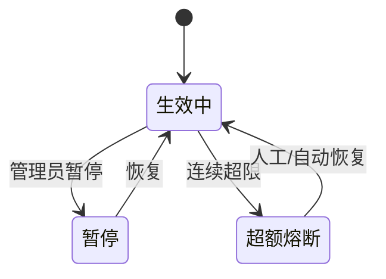

# 模型调用配额与限流管理 产品需求文档（PRD）

> 本文档为使用 `pm-prd-standard` skill **实际产出**的验证样例，模块选"模型调用配额与限流"，专门检验新增的 模型管理 / 接口契约 / 灰度发布 / 边界场景 等章节落地效果。
> 隐私说明：以"平台/租户/开发者"代称。

## 1. 文档概览与修订记录
| 版本 | 日期 | 修改人 | 审批人 | 状态 | 变更类型 | 修改内容 |
|------|------|--------|--------|------|----------|----------|
| V0.1 | 2026-07-14 | 产品经理 | — | 草稿 | 新增 | 初稿 |
| V1.0 | 2026-07-15 | 产品经理 | 架构师 | 定稿 | 定稿 | 评审通过 |

## 2. 术语表与缩写
| 术语 | 英文/缩写 | 定义 |
|------|-----------|------|
| 配额 | Quota | 租户在单位时间可调用模型的额度（QPD/QPS） |
| 限流 | Rate Limit | 超过配额时拒绝或降级的策略 |
| API Key | — | 开发者调用模型的凭证 |
| 突发 | Burst | 短时间内超过均值的瞬时流量 |

## 3. 需求背景与目标
- **痛点**：开发者高频突发调用导致模型服务被打挂，单租户故障影响全局；缺乏可视化配额与用量，工单量大。
- **价值**：隔离租户故障域，配额自助管理，用量透明。
- **SMART**：2026-Q4 上线；限流误杀率 < 0.1%；配额配置生效时延 ≤ 1s。
- **角色矩阵**：平台管理员（全局配额策略）、租户管理员（本租户配额）、开发者（调用+查看用量）。

## 4. 范围说明
- **做**：配额设置/调整、API Key 管理、限流策略、用量看板、超限降级。
- **不做**：按模型粒度的动态竞价、跨云调度。

## 5. 信息架构
```
模型管理
├─ 配额设置
├─ API Key 管理
├─ 用量看板
└─ 限流策略配置
```

## 6. 功能清单
- **P0**：配额默认值、API Key 创建/吊销、QPS/QPD 限流、超限返回 429、用量看板。
- **P1**：配额自助申请审批流、突发令牌桶、按模型维度配额。
- **P2**：配额预测告警、成本联动。

## 7. 用户故事
- 作为租户管理员，我希望设置本租户 QPS 上限，以便保护自身预算。
- 作为开发者，我希望超限时收到明确错误与重试提示，以便快速定位。
- 作为平台管理员，我希望查看全局用量，以便容量规划。

## 8. 角色与权限矩阵（RBAC）
| 角色 | 功能权限 | 数据范围 |
|------|----------|----------|
| 平台管理员 | 全局策略、查看所有租户 | 跨租户 |
| 租户管理员 | 本租户配额/Key/用量 | 本租户 |
| 开发者 | 调用、查看本人 Key 用量 | 本 Key |

## 9. 业务规则与状态机

- 配额：QPD（日调用次数）、QPS（并发）。默认 QPS=20，QPD=100000。
- 限流算法：令牌桶（突发上限 = QPS × 2）。
- 超限策略：返回 HTTP 429 + Retry-After 头，不降级业务数据。

## 10. 详细功能说明（API Key 管理）
- 前置：租户管理员已认证。
- 主流程：创建 Key → 系统生成密钥（仅展示一次）→ 绑定配额 → 启用。
- 异常：Key 泄露 → 一键吊销，立即生效（≤ 1s）。
- 后置：Key 事件入审计。

## 11. 交互流程
1. 开发者持 Key 调 /v1/models/{id}/invoke。
2. 网关校验 Key → 查配额 → 令牌桶判余量。
3. 有余量 → 放行；无余量 → 429 + Retry-After。

## 12. 数据模型
| 字段 | 类型 | 含义 |
|------|------|------|
| api_key | string | 密钥（密文存储） |
| tenant_id | string | 租户 |
| qps_limit | int | QPS 上限 |
| qpd_limit | int | 日调用上限 |
| used_today | int | 当日已用 |

## 13. 接口/数据契约
| 接口 | 方法 | 路径 | 幂等键 | 关键字段 | 错误码 |
|------|------|------|--------|----------|--------|
| 调用模型 | POST | /v1/models/{id}/invoke | request_id | api_key, model_id | 429 限流 / 401 无效 Key |
| 设配额 | PUT | /v1/quota | — | tenant_id, qps_limit | 4003 超全局上限 |

## 14. 存量数据迁移与兼容
- 老 Key：默认继承全局默认配额，不中断在途调用。
- 老调用方：过渡期兼容无 Key 调用（仅内部），截止上线后 30 天。

## 15. 边界场景
- **异常**：Key 无效、配额未配、模型不存在。
- **极限**：单 Key 瞬时 10×QPS 突发 → 令牌桶放 2× 后全部 429。
- **并发**：多 Key 同租户共享 QPS 池 → 网关聚合判桶。

## 16. 验收标准
| AC ID | 前置 | 操作 | 期望 | 阈值 |
|-------|------|------|------|------|
| AC-01 | Key 有效、余量足 | 调用 | 200 | 时延 P99 ≤ 150ms |
| AC-02 | 余量 0 | 调用 | 429 + Retry-After | 误杀 < 0.1% |
| AC-03 | 吊销 Key | 用旧 Key 调用 | 401 | 生效 ≤ 1s |

## 17. 非功能需求
- 性能：网关限流判定 P99 ≤ 5ms。
- 可靠：限流服务可用性 99.99%（故障默认放行并告警）。
- 安全：Key 密文存储、传输 TLS、最小权限。
- 可观测：限流次数/429 占比/Key 调用 TOP 看板。

## 18. 数据埋点
| 埋点ID | 位置 | 事件 | 字段 |
|--------|------|------|------|
| ML01 | 网关 | invoke | tenant_id, model_id, cost_ms |
| ML02 | 网关 | rate_limited | tenant_id, limit_type |

## 19. 灰度发布与回滚
- 放量：白名单租户 → 30% → 100%。
- 熔断：429 占比异常升高（>5%）→ 暂停，回退"不限流"开关。
- 回滚：配置开关，无需发版。

## 20. 国际化/多币种/税务
- 多币种：按调用抵扣额度（token/次），展示用租户基准币种。
- 时区：QPD 以租户时区自然日切分。

## 21. 风险与依赖
| 风险 | 概率 | 影响 | 缓解 |
|------|------|------|------|
| 限流误杀正常流量 | 中 | 高 | 令牌桶+监控+快速回滚 |
| 网关成为瓶颈 | 低 | 高 | 无状态水平扩容 |
| Key 泄露 | 中 | 中 | 一键吊销+审计 |
