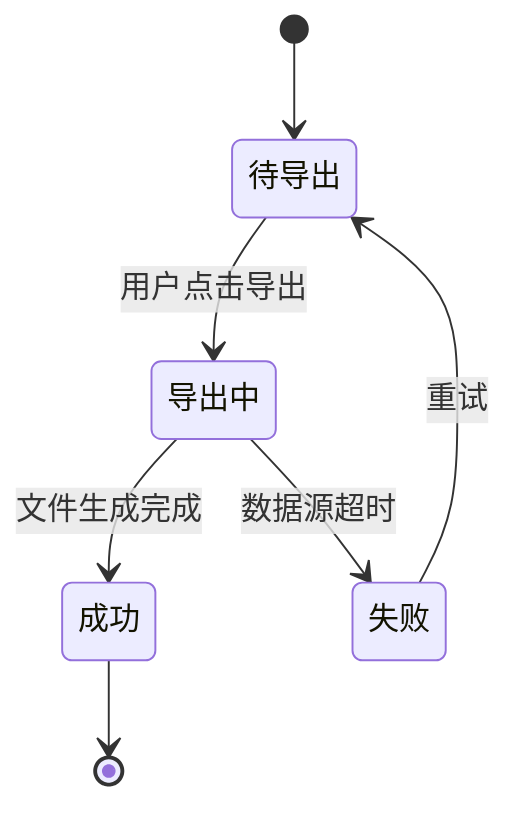

# 租户账单导出 产品需求文档（PRD）

> 本文档为 `pm-prd-standard` skill 的**标杆范例**，展示一份"标准版"PRD 的质量水位。新模块 PRD 可直接参考本结构。
> 隐私说明：以"平台/租户"代称，隐去公司实名与品牌；示例数据已脱敏。

## 1. 文档概览与修订记录
| 版本 | 日期 | 修改人 | 审批人 | 状态 | 变更类型 | 修改内容 |
|------|------|--------|--------|------|----------|----------|
| V0.1 | 2026-07-14 | 产品经理 | — | 草稿 | 新增 | 初稿 |
| V0.5 | 2026-07-18 | 产品经理 | — | 评审中 | 修订 | 补充 RBAC 与接口契约 |
| V1.0 | 2026-07-20 | 产品经理 | 产品总监 | 定稿 | 定稿 | 评审通过，进入开发 |

## 2. 术语表与缩写
| 术语 | 英文/缩写 | 定义 |
|------|-----------|------|
| 账单 | Bill | 按账期向租户出具的应收明细集合 |
| 出账 | Billing | 系统按规则生成账单的过程 |
| 账期 | Billing Period | 账单对应的自然月，如 2026-08 |
| 勾稽 | Reconciliation | 待还 = 应付 − 已还 的金额核对关系 |

## 3. 需求背景与目标
- **业务背景（痛点）**：财务每月手动从后台导出账单并拼装 Excel，平均耗时 4 人时/月，跨 sheet 复制错误率约 3%，且无法按产品下钻。
- **业务价值**：自助导出将财务人力降至 0.5 人时/月，错误率趋零，支持审计留痕。
- **SMART 目标**：2026-Q4 前上线，导出任务 P99 ≤ 3s 返回链接，导出内容准确率 100%（差异 = 0）。
- **用户角色矩阵**：租户财务（导出本租户账单）、租户管理员（查看）、平台运营（排查异常）。

## 4. 范围说明（In/Out of Scope）
- **本期做**：按账期/产品维度导出 PDF + CSV；多币种展示；导出记录留痕。
- **本期不做**：跨租户合并导出、自动定时邮件推送、导出后在线编辑。

## 5. 信息架构（页面树）
```
账单中心
├─ 账单列表（月维度）
│  ├─ 账单详情
│  └─ 导出（PDF / CSV）
└─ 导出记录
```

## 6. 功能清单（P0/P1/P2）
- **P0**：账单列表查看、单账期导出 PDF/CSV、导出记录留痕、权限校验。
- **P1**：按产品下钻导出、多币种展示、导出进度提示。
- **P2**：导出模板自定义、批量账期导出。

## 7. 用户故事
- 作为租户财务，我希望按账期导出账单 PDF，以便归档审计。
- 作为租户财务，我希望导出 CSV 含逐笔明细，以便对账。
- 作为租户管理员，我希望仅看到本租户数据，以便隔离。

## 8. 角色与权限矩阵（RBAC）
| 角色 | 功能权限 | 数据范围 | 备注 |
|------|----------|----------|------|
| 平台运营 | 查看所有租户、排查导出异常 | 跨租户 | 敏感操作二次确认 |
| 租户管理员 | 查看本租户账单 | 本租户 | — |
| 租户财务 | 查看 + 导出本租户账单 | 本租户 | 不可改配置 |

## 9. 业务规则与状态机

- 出账时间规则：每月 1 日 02:00 出上月账单。
- 数据延迟：账单数据 T+1 对齐，导出取快照。
- 查询窗口：支持近 24 个月。

## 10. 详细功能说明（以"导出"为例）
- **前置条件**：用户已登录且拥有本租户导出权限；目标账期账单已出账。
- **主流程**：进入账单详情 → 选格式（PDF/CSV）→ 点导出 → 生成任务 → 返回下载链接。
- **异常流程**：数据源超时 → 提示"稍后重试"并保留任务记录；无权限 → 拦截并提示。
- **后置条件**：导出记录写入审计表。

## 11. 交互流程
1. 用户进入账单列表，选 2026-08。
2. 点"导出"，弹窗选格式与维度（全部/按产品）。
3. 系统调用导出服务，返回下载链接（≤ 3s）。
4. 用户下载，记录留痕。

## 12. 数据模型（字段语义表）
| 字段 | 类型 | 含义 |
|------|------|------|
| bill_id | string | 账单唯一 ID |
| tenant_id | string | 租户 ID |
| period | ym | 账期，如 202608 |
| currency | string | 币种，如 CNY |
| payable | decimal | 应付总额 |
| paid | decimal | 已还 |
| outstanding | decimal | 待还 = payable − paid |

## 13. 接口/数据契约（API Contract）
| 接口 | 方法 | 路径 | 幂等键 | 关键字段 | 错误码 |
|------|------|------|--------|----------|--------|
| 导出账单 | POST | /v1/bills/export | req_id | bill_id, format, dimension | 4040 无权限 / 4090 账期不存在 |

## 14. 存量数据迁移与兼容方案
- 存量已出账单（2026-08 前）：提供只读归档，结构不变。
- 新导出服务：独立链路，不影响老账单查询。
- 导出记录表：新建，历史不回迁。

## 15. 边界场景
- **异常**：数据源超时、无权限、账期不存在。
- **极限**：单租户单账期明细 100 万行 → 异步导出 + 分片下载。
- **并发**：同一租户 10 人同时导出 → 队列限流，每人独立任务。

## 16. 验收标准（Given/When/Then）
| AC ID | 来源故事 | 前置 | 操作 | 期望 | 量化阈值 |
|-------|----------|------|------|------|----------|
| AC-01 | 财务导出 PDF | 已登录有账单 | 点导出 PDF | 返回链接 | ≤ 3s |
| AC-02 | 财务导出 CSV | 已登录有账单 | 点导出 CSV | 含逐笔明细 | 行数 = 明细数，差异 0 |
| AC-03 | 权限隔离 | 非本租户 | 调接口 | 拦截 | 返回 4040 |

## 17. 非功能需求
- 性能：导出 P99 ≤ 3s（≤ 1 万行）；大数据异步 ≤ 2min。
- 可靠：导出服务可用性 99.9%。
- 安全：租户间行级隔离；下载链接有效期 15 分钟、签名防篡改。
- 可观测：导出耗时/成功率埋点 100%。

## 18. 数据埋点
| 埋点ID | 位置 | 事件 | 触发 | 关键字段 | 方式 |
|--------|------|------|------|----------|------|
| BE01 | 账单详情 | bill_view | 曝光 | tenant_id, period | 实时 |
| BE02 | 导出按钮 | bill_export | 点击 | tenant_id, format | 实时 |
| BE03 | 下载 | bill_download | 点击 | tenant_id, cost_ms | 实时 |

## 19. 灰度发布与回滚计划
- 放量：内部租户 → 10% → 50% → 100%（每阶段 ≥ 1 日）。
- 熔断：导出失败率 > 2% 自动暂停。
- 回滚：开关切回老后台导出，无需发版。

## 20. 国际化/多币种/税务
- 多币种：金额 + 币种 + 汇率快照 + 基准币种 CNY。
- 税务：PDF 含税额与不含税额，按租户地区税率。
- 时区：账期以租户时区为准。

## 21. 风险与依赖
| 风险 | 概率 | 影响 | 缓解 |
|------|------|------|------|
| 导出服务超时 | 中 | 高 | 异步化 + 重试 + 熔断 |
| 大数据 OOM | 低 | 高 | 分片流式导出 |
| 依赖账单服务不稳定 | 中 | 中 | 取快照解耦 |
