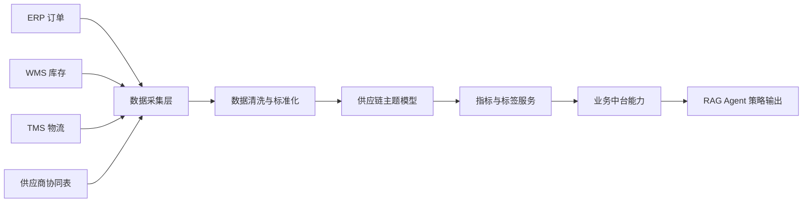

# 数据中台与业务中台流程框架

## 1. 总体架构（目标态）

v1 已验证的是 E→F→G→H→I 这条链路在真实 SKU 级数据上跑得通（用 `clean_supply_chain.csv` 替代了 A/B/C/S 四个系统源）；A/B/C/S 的多系统采集尚未接入，是 v2 的工作。

## 2. 数据中台流程（标注 v1 状态）

| 阶段 | 输入 | 处理 | 输出 | v1 状态 |
|---|---|---|---|---|
| 数据采集 | 订单、库存、供应商、物流数据 | 批量导入/API/消息订阅 | 原始数据区 | v1 为批量 CSV 导入（真实公开数据集），API/消息订阅接入是 v2 工作 |
| 数据清洗 | 原始表 | 字段映射、去重、缺失值处理 | 标准明细层 | **已验证**，见 `scripts/clean_data.py` |
| 主数据建模 | SKU、仓库、供应商、客户 | 编码统一、维表维护 | 主数据层 | **部分验证**：SKU/供应商/城市已建模，仓库/客户实体推迟至 v2 |
| 主题建模 | 履约、库存、采购、物流 | 宽表与事实表建设 | 供应链主题层 | **部分验证**：库存/质量/物流主题已验证，履约（订单）主题推迟至 v2 |
| 指标计算 | 明细与主题数据 | 履约率、周转天数、缺货风险 | 指标服务层 | **部分验证**，见第 6 节指标口径对照 |

## 3. 核心数据对象：目标模型 → v1 真实数据映射

| 目标实体 | 目标主键 | 目标关键字段 | v1 真实数据对应 | 差距说明 |
|---|---|---|---|---|
| SKU | sku_id | 品类、单位、保质期、默认安全库存 | `sku` / `product_type`（`clean_supply_chain.csv`） | 已覆盖品类；保质期、默认安全库存字段暂无，安全库存改为按公式实时计算，而非存储字段 |
| 仓库 | warehouse_id | 区域、容量、服务范围 | `location`（城市维度，覆盖 Mumbai/Kolkata/Chennai/Bangalore/Delhi） | v1 只有城市颗粒度，无独立仓库实体和容量字段 |
| 订单 | order_id | 客户、SKU、需求数量、承诺交期、优先级 | 无对应 | v1 数据集不含订单实体，推迟至 v2 接入企业系统 |
| 库存 | sku_id + warehouse_id | 可用库存、锁定库存、在途库存 | `stock_level`（单一库存快照） | v1 只有现存库存，无锁定/在途库存的拆分 |
| 供应商 | supplier_id | 交期、MOQ、准时率、质量评分 | `supplier_name` / `lead_time_days` / `defect_rate` | 已覆盖交期与质量（缺陷率代理质量评分）；MOQ、显式准时率（OTIF）字段暂无，v1 用"交期是否超过均值+2σ"作为交付达标的代理指标（见 `knowledge_base/sop.md`） |
| 物流 | shipment_id | 起点、终点、承运商、状态、预计到达 | `shipping_carrier` / `shipping_time_days` / `transport_mode` / `route` | 已覆盖承运商、时效、运输方式、路线；无实时状态与预计到达（数据集是快照，不是流式状态） |

## 4. 业务中台能力：v1 已实现 vs v2 规划

| 能力 | 目标功能 | v1 状态 | v1 对应实现 |
|---|---|---|---|
| 库存分析服务 | 低库存筛选、库存分布 | **已实现** | `low_stock_skus` 工具 |
| 供应商质量评估服务 | 缺陷率排名、供应商评分卡 | **已实现** | `supplier_defect_ranking` / `supplier_scorecard` 工具 |
| 物流时效分析服务 | 分城市/供应商提前期统计 | **已实现** | `avg_lead_time_by_location` / `lead_time_stats` 工具 |
| 营收分类服务 | ABC 分类与营收占比 | **已实现** | `abc_classification` 工具 |
| SOP 知识服务 | 安全库存/ROP/EOQ/AQL/评分卡方法论检索 | **已实现** | RAG 本地知识库（3 篇，见 `knowledge_base/`） |
| 策略解释服务 | 输出规则依据、参数来源、风险提示 | **已实现** | RAG Agent 统一输出 scenario/findings/strategy/risks/evidence 结构 |
| 补货策略服务（自动触发） | 安全库存/再订货点自动计算并触发补货单 | **规划中（v2）** | 公式已在知识库中可查，但 v1 未接入订单实体，无法自动生成补货单，需先补齐第 3 节的"订单"实体 |
| 供应商协同服务（替代推荐） | 高风险供应商自动推荐替代方案 | **规划中（v2）** | `knowledge_base/sop.md` 的 SOP-3 已定义处理流程，但替代供应商匹配逻辑未实现，需要供应商主数据扩展 MOQ/产能字段 |
| 履约预警服务 | 订单缺口、交付延迟、在途异常 | **规划中（v2）** | 依赖"订单"实体，v1 无订单数据 |

## 5. 数据流规范（目标态）

| 数据流 | 触发条件 | 目标 |
|---|---|---|
| 需求流 | 新订单或预测更新 | 更新需求池和优先级 |
| 库存流 | 入库、出库、锁定、盘点 | 更新可用库存 |
| 供应流 | 采购订单确认、交期变更 | 更新供应承诺 |
| 物流流 | 发运、到站、签收、异常 | 更新在途状态 |
| 策略流 | 缺货/延期/积压风险触发 | 输出补货、调拨、升级建议 |

## 6. 指标口径：与知识库公式对齐

v1 的原则是**指标口径只在一个地方定义**——`knowledge_base/` 下带引用来源的方法论文档，本表只做导航，不重复定义，避免两处口径打架。

| 指标 | 单一事实来源 | v1 落地方式 |
|---|---|---|
| 安全库存 SS | `knowledge_base/business_rules.md > 1` | 公式 `SS = Z × σ_d × √L`，由 RAG 检索获取定义；数值由查询时代入真实 `units_sold` 标准差与 `lead_time_days` 计算，非存储字段 |
| 再订货点 ROP | `knowledge_base/business_rules.md > 2` | `ROP = d̄ × L + SS` |
| 经济订货批量 EOQ | `knowledge_base/algorithm_params.md > 1` | `EOQ = √(2DS/H)` |
| ABC 分类 | `knowledge_base/algorithm_params.md > 2` | 按 `revenue` 降序累计占比分层，由 `abc_classification` 工具实时计算 |
| 质量达标判定（AQL） | `knowledge_base/sop.md > SOP-1` | `defect_rate > 2.5%` 判不达标（ANSI/ASQ Z1.4 标准） |
| 供应商综合评分卡 | `knowledge_base/sop.md > SOP-2` | 质量 40% + 交付（OTIF 代理）35% + 成本 25% 加权，由 `supplier_scorecard` 工具计算 |

