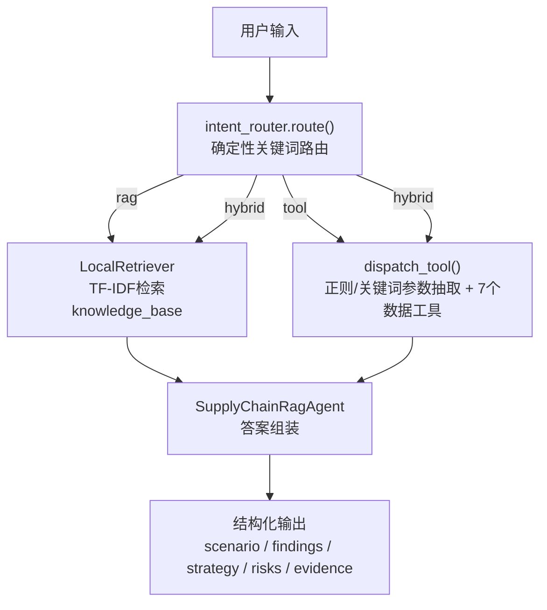

# MCP 风格 RAG Agent 设计说明

## 0. 与其他文档的关系

02 定义了"为什么做"和"v1 范围"，03 定义了"数据和能力怎么分层"，本文档定义"Agent 内部怎么跑"，06 记录了"跑起来之后发现了什么问题、怎么修的"。

## 1. 设计目标

Agent 需要完成四件事：

1. 判断用户输入的问题该用什么方式回答（意图路由）。
2. 如果涉及方法论/公式/SOP，从本地知识库检索（RAG）。
3. 如果涉及具体数值，调用数据工具直接查真实数据，而不是让模型生成或臆测。
4. 输出结构化、可解释、带依据来源的策略建议。

这四件事分别对应代码里的四个模块：`intent_router.py` / `rag_agent.py::LocalRetriever` / `mcp_tools.py` / `rag_agent.py::SupplyChainRagAgent`。

## 2. 整体架构



## 3. 意图路由：三张关键词表决定走哪条路

路由逻辑是纯规则、可解释、零外部依赖（`intent_router.py`），依据三张关键词表：

| 关键词表 | 内容示例 | 含义 |
|---|---|---|
| FORMULA_TERMS | 安全库存 / 再订货点 / rop / eoq / abc / aql / 评分卡 / 公式 / 服务水平 | 问的是方法论/公式定义 |
| CONCRETE_DATA_TERMS | sku0-sku5 / mumbai / kolkata / 最低 / 最高 / 低于 / 平均 / 各城市 / 均值 | 问的是具体数据实体或量化请求 |
| SOP_TERMS | 风险 / sop / 管控 / 预警 / 策略 / 达标 / 是否触发 / 判为 / 应采用 | 问的是判定/决策类场景 |

判定规则（与源码逻辑一致）：

```
has_f, has_cd, has_s = 命中上述三张表
if has_f and has_cd:  return "hybrid"   # 公式套到具体数据
if has_s and has_cd:  return "hybrid"   # 判定套到具体数据
if has_f:  return "rag"                 # 纯定义/释义类
if has_cd: return "tool"                # 纯数值查询类
return "rag"                            # 默认兜底
```

**设计取舍**：为什么不直接上 LLM 路由？——因为 v1 的目标是先验证"规则路由能不能达到可用水平"，而不是先假设"规则不够用"。21 条评测集上，确定性路由达到 90.5% 准确率，且两条未命中的 case 端到端答案仍然正确（详见 06）。要升级 LLM 路由，需要先建立 held-out 评测集防止过拟合，不能凭感觉换。

## 4. RAG 检索层：知识怎么切、怎么查

### 4.1 切片（`chunker.py`）

按 Markdown 标题（`##`）切片，而不是固定字符窗口——因为人类作者已经用标题划好了"一个自洽的作答单元"的边界。每个 chunk 携带 `section_path` 来源路径（如 `business_rules.md > 2. 再订货点`），即使 chunk 被单独召回，模型也知道它属于哪篇文档的哪一节。超长节回退滑动窗口（800 字符 / 80 重叠）做护栏，避免单块撑爆上下文。

### 4.2 检索（`LocalRetriever`，TF-IDF）

零外部依赖的关键词检索，对中文按字符、英数按词混合分词。针对"补货优先级"这类综合决策问法容易漏检的问题，加了轻量同义词扩展（`QUERY_SYNONYMS`，如"补货→库存/风险/缺陷率"），但**只在 query 命中特定触发词时生效**，不影响其他已正确的检索——这是"精准打补丁"而不是"盲目上向量检索"的设计选择，具体案例见 06 第 3.3 节。

## 5. 工具层：7 个真实数据工具（`mcp_tools.py` / `mcp_server.py`）

所有数值/统计类回答直接查询 `clean_supply_chain.csv` 的真实行，不经过文本生成——这是"RAG 管知识、MCP 管数据"架构分工在代码里的落地。

| 工具名 | 输入 | 输出 | 用途 |
|---|---|---|---|
| find_sku | sku | 该 SKU 全部真实字段（价格/库存/交期/成本/供应商等） | 单 SKU 明细查询 |
| low_stock_skus | location?, threshold?, top_n? | 低库存 SKU 列表 | 缺货风险筛查 |
| supplier_defect_ranking | 无 | 按供应商聚合的平均缺陷率排名 | 供应商质量对比 |
| avg_lead_time_by_location | 无 | 按城市聚合的平均实际提前期 | 物流时效对比 |
| lead_time_stats | 无 | 全数据集提前期均值/标准差/均值+2σ | 异常提前期判定基线 |
| abc_classification | 无 | 按营收 ABC 分类 + top20% 营收占比 | 营收结构分析 |
| supplier_scorecard | sku | 质量/交付达标判定 + 评分 | 供应商综合评估 |

以上 7 个工具加一个编排入口 `generate_strategy`（内部调用 `SupplyChainRagAgent`，走完整的路由+检索+工具+组装链路），通过 `mcp_server.py` 以 JSON-RPC 协议对外暴露（`tools/list` + `tools/call`）——这是"MCP 风格"的具体含义：工具协议化，而不是把 7 个函数堆在一起给调用方猜。

## 6. 参数抽取与工具派发（`dispatch_tool`）

用正则从 query 里抽取 SKU 编号（`sku\d+`）、城市名（枚举匹配 5 城市）、数值阈值（`低于\s*(\d+)`），再按关键词派发到对应工具。这一层曾经暴露过两个真实 bug（字符串写死匹配漏掉"的"字、参数抽到了但没有对应分支消费），完整拆解过程见 06 第 3.1-3.2 节——本文档只记录**修复后**的设计原则：数量类抽取统一用 `\D*(\d+)` 容忍中文虚词穿插；阈值抽取后必须有对应分支消费，不允许"抽到但不用"的哑变量。

## 7. 输出契约：统一的可解释结构

无论走 rag / tool / hybrid 哪条路，Agent 输出统一包含五段：

- **scenario**：场景判断（这是什么类型的问题）
- **findings**：关键发现（检索到什么/查到什么数值）
- **strategy**：推荐策略
- **risks**：风险提示（适用前提、口径确认项）
- **evidence**：依据来源（RAG 命中的 chunk 来源、section_path、相关度分数）

这个契约的设计原则是"沉默失败比响亮失败更危险"（06 第 3.1 节的教训）——所以即使是 tool 类回答，也强制带 risks 字段提醒"数值随数据集更新而变化"，不让用户误以为这是一个一成不变的结论。

## 8. 设计决策记录（ADR 摘要）

| 决策 | 选择 | 备选方案 | 为什么不选备选方案 |
|---|---|---|---|
| 检索方式 | TF-IDF 关键词检索 | 向量检索 + rerank | 21 条评测集上 TF-IDF 召回率已达 100%，无证据支撑升级收益；先证伪"检索不够用"这个假设，再决定要不要花成本升级（详见 06 第 2 节） |
| 意图路由 | 确定性关键词规则 | LLM 路由 | 规则路由 90.5% 准确率且可解释、零延迟成本、零外部依赖；两条未命中 case 端到端答案仍正确，说明当前瓶颈不在路由 |
| 标注方式（评测） | 语义锚点（来源 > 标题） | 位置编号（第 N 块） | 位置编号曾导致 Recall 虚报 21.4%（chunker 实际编号与人工标注编号错位），语义锚点不受 chunk 顺序变化影响 |
| 数据源 | 真实公开数据集 | 手工编造的示例数据 | 编造数据无法暴露真实数据质量问题（如 `lead_times_days` 与 `lead_time_days` 零相关这类真实陷阱），评测结果也难以获得可信度 |

## 9. 扩展方向（v2，已用 v1 结果校准过）

- 检索升级：先确认是真实检索缺口（而非标注缺口）再考虑向量混合检索 + rerank——当前证据不支持，升级前需先扩大评测集，看是否出现 TF-IDF 召回不足的 case。
- 路由升级：确定性规则 → LLM 路由，需先建立 held-out 评测集，防止过拟合于当前 21 条 case。
- 工具升级：本地 CSV → 数据库/MCP 真实服务，按 03 第 3 节的差距表补齐订单/仓库实体后，再扩展 `replenishment_strategy` 等业务语义工具。
- 评测升级：21 条 → 更大规模 + 自动化黄金标注抽检 + CI 回归门禁。
